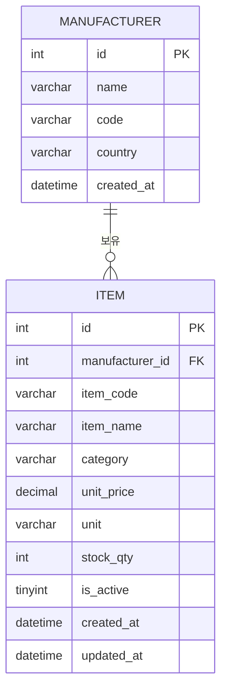
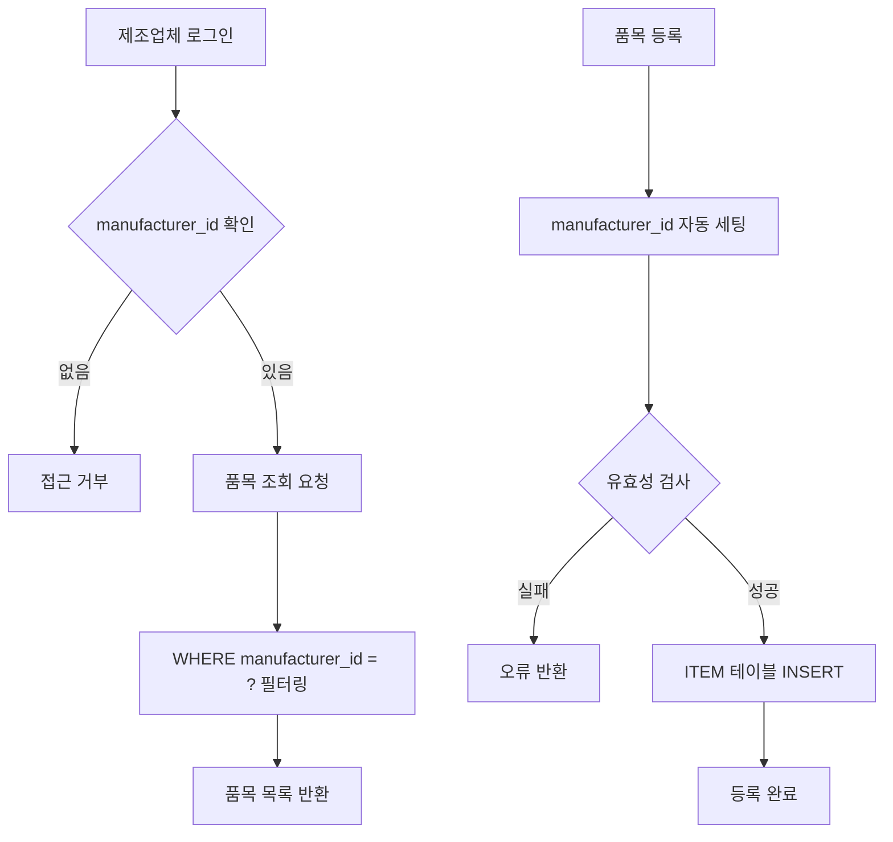

# 다중 제조업체 품목 관리 구조

## 개요

여러 제조업체가 **하나의 테이블**에서 품목을 관리하는 멀티테넌트 구조입니다.
`manufacturer_id` 필드로 업체를 구분합니다.

---

## ERD (테이블 구조)



---

## 데이터 흐름



---

## MySQL DDL

```sql
-- 제조업체 테이블
CREATE TABLE manufacturer (
    id          INT AUTO_INCREMENT PRIMARY KEY,
    name        VARCHAR(100) NOT NULL COMMENT '업체명',
    code        VARCHAR(20)  NOT NULL UNIQUE COMMENT '업체코드',
    country     VARCHAR(50)  DEFAULT '한국',
    created_at  DATETIME     DEFAULT CURRENT_TIMESTAMP
) COMMENT = '제조업체';

-- 품목 테이블 (멀티테넌트)
CREATE TABLE item (
    id              INT AUTO_INCREMENT PRIMARY KEY,
    manufacturer_id INT          NOT NULL COMMENT '제조업체 ID',
    item_code       VARCHAR(50)  NOT NULL COMMENT '품목코드',
    item_name       VARCHAR(200) NOT NULL COMMENT '품목명',
    category        VARCHAR(50)  COMMENT '카테고리',
    unit_price      DECIMAL(15,2) DEFAULT 0 COMMENT '단가',
    unit            VARCHAR(20)  DEFAULT 'EA' COMMENT '단위',
    stock_qty       INT          DEFAULT 0 COMMENT '재고수량',
    is_active       TINYINT(1)   DEFAULT 1 COMMENT '사용여부',
    created_at      DATETIME     DEFAULT CURRENT_TIMESTAMP,
    updated_at      DATETIME     DEFAULT CURRENT_TIMESTAMP ON UPDATE CURRENT_TIMESTAMP,

    FOREIGN KEY (manufacturer_id) REFERENCES manufacturer(id),
    UNIQUE KEY uq_item (manufacturer_id, item_code)
) COMMENT = '품목 (멀티테넌트)';

-- 인덱스
CREATE INDEX idx_item_manufacturer ON item(manufacturer_id);
CREATE INDEX idx_item_category     ON item(manufacturer_id, category);
```

---

## 샘플 데이터

```sql
-- 제조업체 3개
INSERT INTO manufacturer (name, code, country) VALUES
('삼성전자',   'SAMSNG', '한국'),
('LG전자',     'LGELEC', '한국'),
('현대자동차', 'HYUNDAI', '한국');

-- 삼성전자 품목
INSERT INTO item (manufacturer_id, item_code, item_name, category, unit_price, unit, stock_qty) VALUES
(1, 'SAM-TV-001', 'QLED TV 55인치',    'TV',     1500000, 'EA', 50),
(1, 'SAM-PH-001', '갤럭시 S25',        '휴대폰', 1200000, 'EA', 200),
(1, 'SAM-WS-001', '세탁기 17kg',       '가전',    890000, 'EA', 30);

-- LG전자 품목
INSERT INTO item (manufacturer_id, item_code, item_name, category, unit_price, unit, stock_qty) VALUES
(2, 'LG-TV-001',  'OLED TV 65인치',    'TV',     2500000, 'EA', 20),
(2, 'LG-AC-001',  '에어컨 16평형',     '가전',    980000, 'EA', 45),
(2, 'LG-RF-001',  '냉장고 870L',       '가전',   1700000, 'EA', 15);

-- 현대자동차 품목
INSERT INTO item (manufacturer_id, item_code, item_name, category, unit_price, unit, stock_qty) VALUES
(3, 'HYD-PT-001', '엔진오일 필터',     '부품',    15000, 'EA', 500),
(3, 'HYD-PT-002', '브레이크 패드',     '부품',    45000, 'SET', 300),
(3, 'HYD-PT-003', '타이어 225/60R18', '타이어', 180000, 'EA', 120);
```

---

## 조회 쿼리 예시

```sql
-- 특정 업체 품목만 조회 (멀티테넌트 핵심)
SELECT
    m.name AS 업체명,
    i.item_code,
    i.item_name,
    i.category,
    FORMAT(i.unit_price, 0) AS 단가,
    i.stock_qty AS 재고
FROM item i
JOIN manufacturer m ON i.manufacturer_id = m.id
WHERE i.manufacturer_id = 1   -- 삼성전자만
  AND i.is_active = 1
ORDER BY i.category, i.item_code;

-- 전체 업체 품목 현황
SELECT
    m.name AS 업체명,
    COUNT(*)            AS 품목수,
    SUM(i.stock_qty)    AS 총재고
FROM item i
JOIN manufacturer m ON i.manufacturer_id = m.id
GROUP BY m.id, m.name;
```

---

## 멀티테넌트 핵심 포인트

| 항목 | 내용 |
|------|------|
| 구분 키 | `manufacturer_id` |
| 중복 방지 | `UNIQUE(manufacturer_id, item_code)` — 업체별 품목코드 중복 허용 |
| 보안 | 쿼리 시 반드시 `WHERE manufacturer_id = ?` 조건 필수 |
| 확장 | 업체 추가 시 `manufacturer` 테이블에 row만 추가 |
