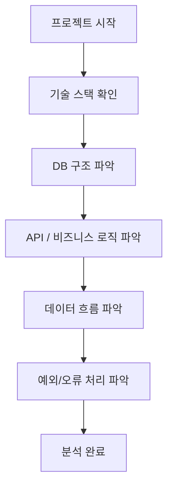
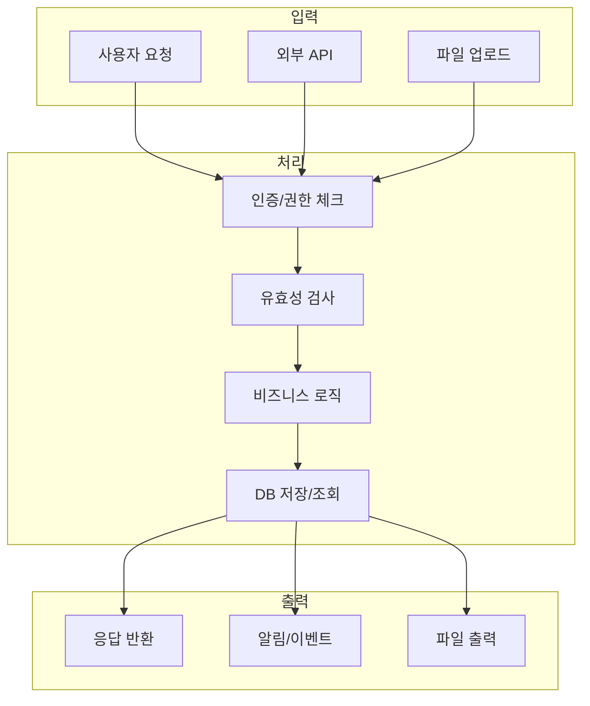
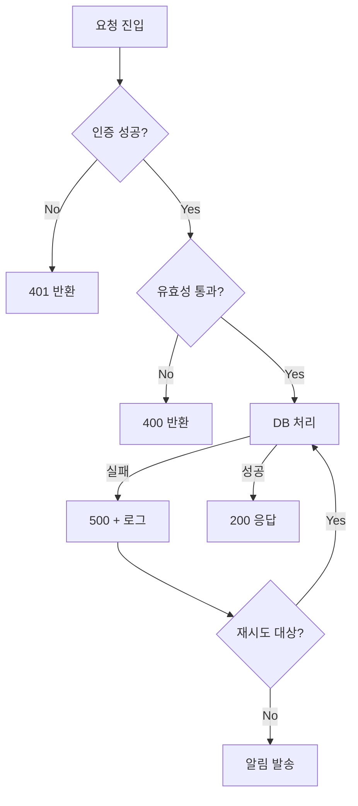
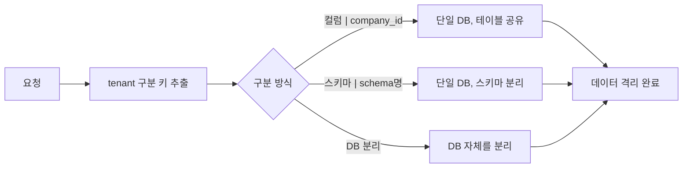

# 프로젝트 분석 가이드 (에이전트 구성용)

> 새로운 프로젝트를 시작하거나 분석할 때 **순서대로** 파악해야 할 항목들.
> 에이전트에게 분석을 맡길 때도 이 구조로 지시하면 효과적.

---

## 1단계 — 프로젝트 전체 구조 파악



### 체크리스트

| 항목 | 질문 | 확인 |
|------|------|------|
| 언어/프레임워크 | Node? Python? Java? | ☐ |
| DB 종류 | MySQL? PostgreSQL? MongoDB? | ☐ |
| 인증 방식 | JWT? Session? OAuth? | ☐ |
| 배포 환경 | Docker? 서버 직접? Cloud? | ☐ |
| 멀티테넌트 여부 | 업체/조직 구분 키 있는가? | ☐ |

---

## 2단계 — DB 구조 분석

> DB는 프로젝트의 **뼈대**. 가장 먼저 파악해야 함.

### 분석 포인트


### 에이전트에게 줄 지시 예시

```
다음을 분석해줘:
1. 테이블 목록과 각 역할
2. PK/FK 관계
3. 멀티테넌트 구분 키 (company_id, org_id 등)
4. 자주 쓰이는 JOIN 패턴
5. ERD를 Mermaid로 그려줘
```

---

## 3단계 — 데이터 흐름 분석

> 데이터가 어디서 들어와서 어디로 나가는지.

### 일반적인 흐름 패턴



### 에이전트에게 줄 지시 예시

```
다음 흐름을 분석해줘:
1. 요청이 들어오는 진입점 (route, controller)
2. 인증은 어디서 처리되는가
3. 데이터 가공 로직
4. DB 쿼리 패턴
5. 응답 형태 (JSON? HTML?)
Mermaid flowchart로 표현해줘.
```

---

## 4단계 — 오류/예외 흐름 분석



### 에이전트에게 줄 지시 예시

```
오류 처리 방식을 분석해줘:
1. HTTP 상태코드별 처리 방식
2. 로그는 어디에 어떻게 남기는가
3. 재시도 로직이 있는가
4. 알림(Slack, 이메일 등) 연동 여부
```

---

## 5단계 — 멀티테넌트 구조 분석

> 여러 업체/조직이 같은 시스템을 쓸 때 반드시 확인.



| 방식 | 장점 | 단점 |
|------|------|------|
| 컬럼 구분 (`company_id`) | 구현 간단 | 실수로 누락 시 데이터 혼재 |
| 스키마 분리 | 격리 확실 | 관리 복잡 |
| DB 분리 | 가장 안전 | 비용 높음 |

---

## 6단계 — 에이전트 분석 지시 템플릿

> 새 프로젝트를 에이전트에게 분석시킬 때 복붙해서 사용.

```
[프로젝트 분석 요청]

프로젝트: {프로젝트명}
경로: {경로}

다음 순서로 분석해줘:

1. 기술 스택 (언어, 프레임워크, DB, 배포)
2. 디렉토리 구조와 각 폴더 역할
3. DB 테이블 목록 + ERD (Mermaid)
4. 주요 API 목록 (endpoint, method, 역할)
5. 정상 데이터 흐름 (Mermaid flowchart)
6. 오류 처리 흐름 (Mermaid flowchart)
7. 멀티테넌트 구분 키와 방식
8. 개선이 필요해 보이는 부분

각 항목을 Mermaid 다이어그램과 함께 MD 파일로 정리해줘.
```

---

## 참고 — 프로젝트 유형별 추가 분석 포인트

| 유형 | 추가 확인 항목 |
|------|--------------|
| ERP / 제조 | 품목코드 체계, 단위 변환, 업체별 기준 차이 |
| 커머스 | 결제 흐름, 재고 동기화, 주문 상태 전이 |
| SaaS | 플랜/권한 체계, 사용량 측정, 빌링 |
| IoT | 디바이스 등록, 데이터 수집 주기, 이상감지 |
| 공공/금융 | 보안 인증, 감사 로그, 개인정보 마스킹 |
